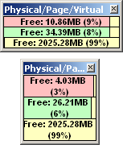



## Small, neat and simple Memory Bar

### Description

This a simple memory monitor that tracks your physical memory, page file memory, and virtual memory. Sure, there are many similar submissions that does a lot more tasks like a task manager, but mine is small but yet informative, without taking up much of desktop space.

*New version released: Please refer to submission on Memory Bar 1.3 at

http://www.pscode.com/vb/scripts/ShowCode.asp?txtCodeId=61310&amp;lngWId=1
 
### More Info
 

             |
---                |---
**Submitted On**   |2005-06-21 18:02:54
**By**             |[Wong Yat Seng](https://github.com/Planet-Source-Code/PSCIndex/blob/master/ByAuthor/wong-yat-seng.md)
**Level**          |Beginner
**User Rating**    |4.7 (14 globes from 3 users)
**Compatibility**  |VB 6\.0
**Category**       |[Windows API Call/ Explanation](https://github.com/Planet-Source-Code/PSCIndex/blob/master/ByCategory/windows-api-call-explanation__1-39.md)
**World**          |[Visual Basic](https://github.com/Planet-Source-Code/PSCIndex/blob/master/ByWorld/visual-basic.md)
**Archive File**   |[Small\_\_nea1904056212005\.zip](https://github.com/Planet-Source-Code/wong-yat-seng-small-neat-and-simple-memory-bar__1-61269/archive/master.zip)

